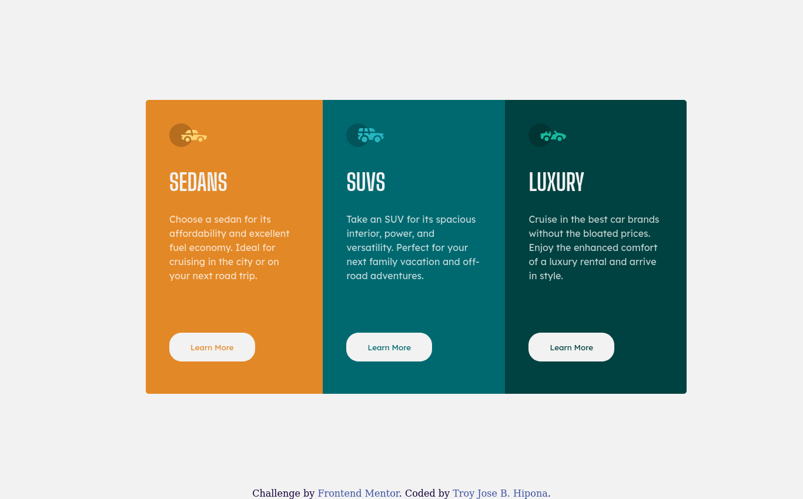

# Frontend Mentor - 3-column preview card component solution

This is a solution to the [3-column preview card component challenge on Frontend Mentor](https://www.frontendmentor.io/challenges/3column-preview-card-component-pH92eAR2-). Frontend Mentor challenges help you improve your coding skills by building realistic projects. 

## Table of contents

- [Overview](#overview)
  - [The challenge](#the-challenge)
  - [Screenshot](#screenshot)
  - [Links](#links)
- [My process](#my-process)
  - [Built with](#built-with)
  - [What I learned](#what-i-learned)
  - [Continued development](#continued-development)
  - [Useful resources](#useful-resources)
- [Author](#author)
- [Acknowledgments](#acknowledgments)

## Overview

  This challenge about making a 3 column layout with different background-colors
  
### The challenge

Users should be able to:

- View the optimal layout depending on their device's screen size
- See hover states for interactive elements

### Screenshot

This is my solution for this challenge.

### Links

- Solution URL: (https://github.com/troy03/3-column-layout)
- Live Site URL: (https://troy03.github.io/3-column-layout/)

## My process

  My process was planning how to center a container and watch a blog and tutorial how to apply it and many solutions that I encounter which is also great but I also use FLexbox for this challenge
### Built with

- Semantic HTML5 markup
- CSS custom properties
- Flexbox

### What I learned

When I first commit this solution some say need to use mobile-approach style so for the next challenge I'm going to learn about this. I use stackoverflow to find a solution why border-radius is not working and it's need to use a property overflow:hidden.Lastly, Gladly realize how important to use semantic layout.

### Continued development

Use this section to outline areas that you want to continue focusing on in future projects. These could be concepts you're still not completely comfortable with or techniques you found useful that you want to refine and perfect.

### Useful resources

- [Best (and worst!) ways to center WITHOUT flex or grid](https://www.youtube.com/watch?v=87YMCtsBoCM) - This helped me for this challenge. I really liked this pattern and will use it going forward.
- [Reason for why overflow happen](https://stackoverflow.com/questions/10995294/border-radius-not-working) - This is an amazing site which helped me finally understand about overflow. 

## Author

- Github- [Troy Jose B. Hipona](https://github.com/)
- Frontend Mentor - [@troy03](https://www.frontendmentor.io/profile/troy03)

## Acknowledgments
 
 Thank you @tesla-ambassador and @EngineerHamziey for helping me and  giving tips in this challenge. Hope you're doing fine.
